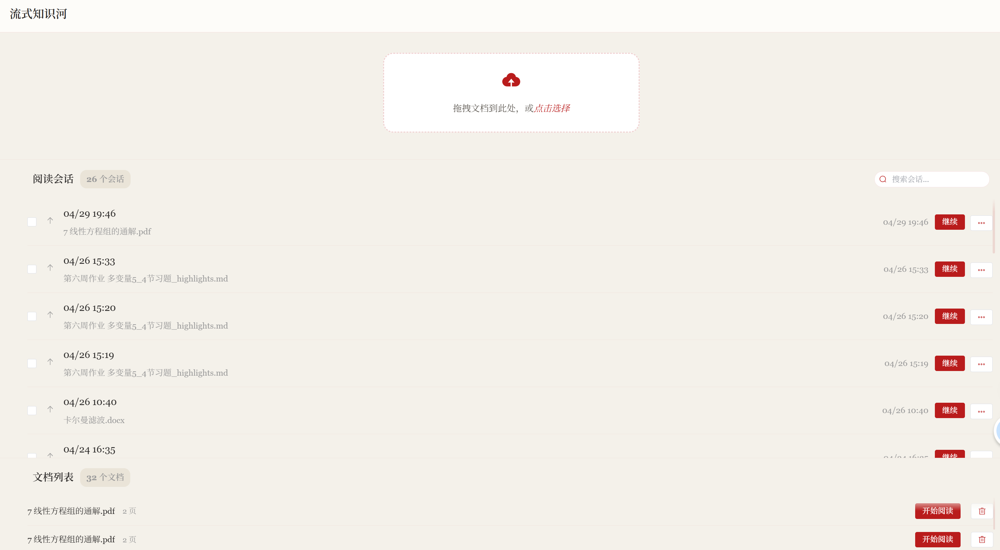
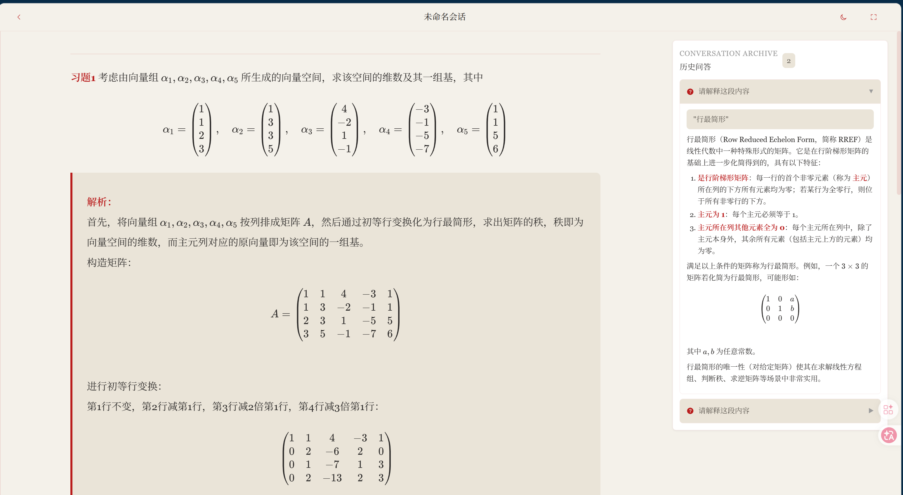
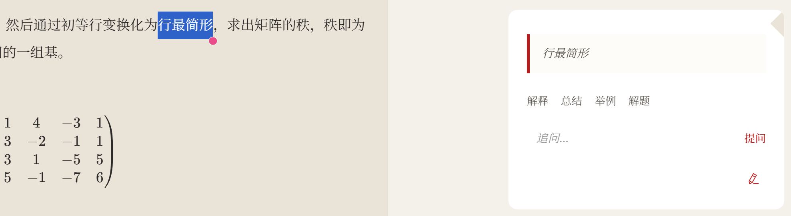
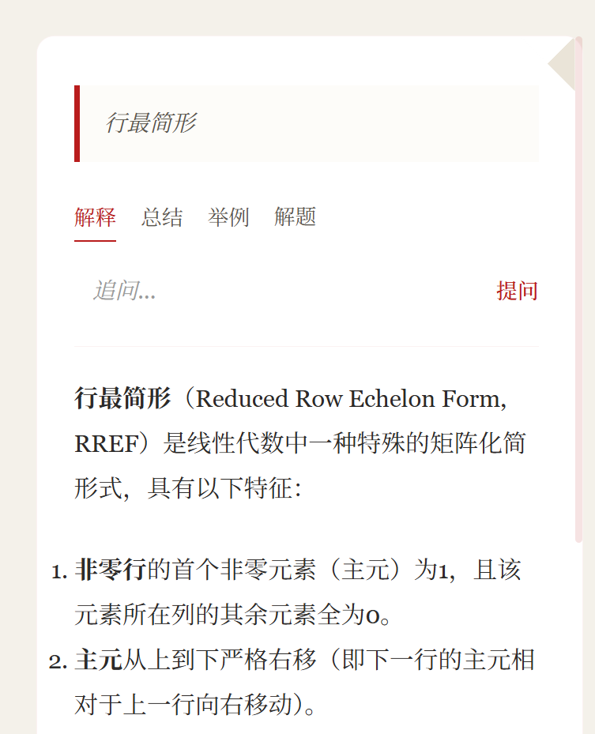
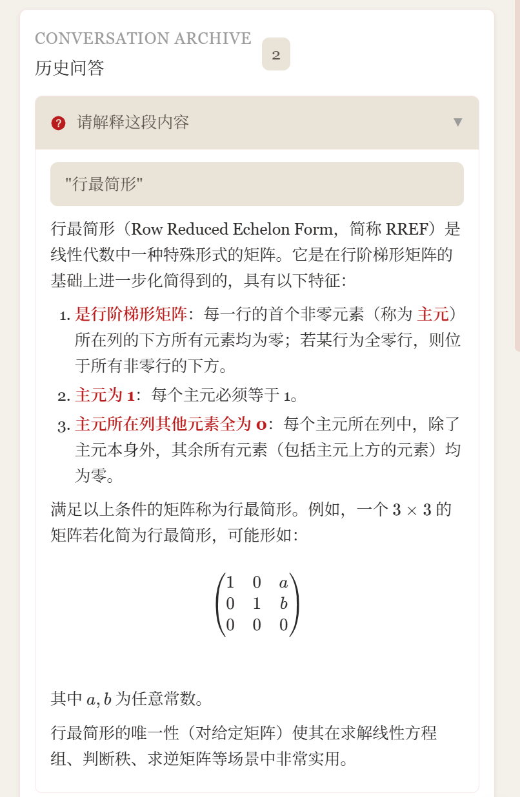
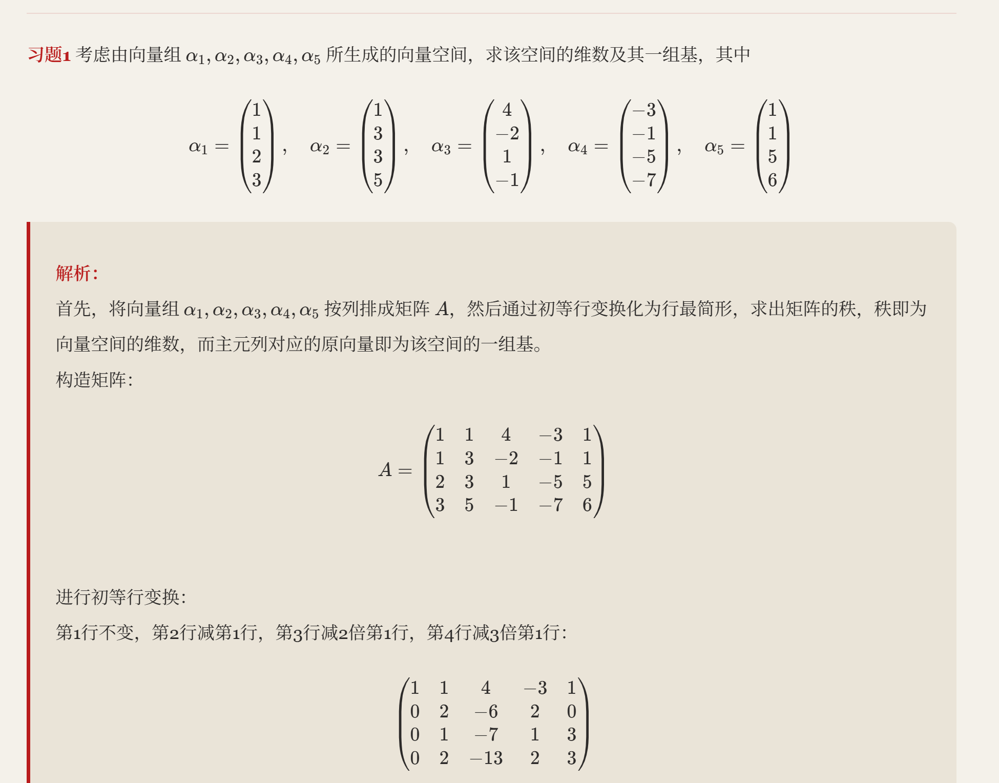

# 流式知识河 (Maphiver)

<p align="center">
  
  
  
  
</p>

> 一个以**对话流驱动、注重知识点自然关联与沉淀**的本地化 AI 学习伴侣。

<p align="center">
  
  <br/>
</p>

---

## 项目简介

**目标用户**：理工科大学生（高等数学、线性代数、大学物理学习场景）

**核心痛点**：

- 阅读教材时存在概念理解障碍，读不懂、记不住
- 学后知识呈碎片化，无法有效关联新旧知识
- 传统 AI 对话难以把握整体知识结构
- 缺乏对"不懂"和"犯错"知识点的沉淀与回顾机制

**产品愿景**：让学习者在与 AI 的自由问答中，自然形成结构化的知识脉络，并专属保存在认知突破时刻的"知识财富"。

---

## 功能预览

### 首页 · 会话与文档管理

<p align="center">
  
</p>

- 拖拽上传 PDF / DOC / DOCX 文档
- 阅读会话列表：快速继续学习进度
- 文档库管理：一键开始阅读

---

### 阅读页 · 沉浸式学习体验

<p align="center">
  
</p>

- **AI 智能格式化**：自动将教材解析为结构化 Markdown，标题、公式、矩阵精准识别
- **衬线字体排版**：Georgia / Noto Serif SC，还原纸质阅读质感
- **右侧历史面板**：Conversation Archive 随时回溯过往问答

---

### 划词提问 · 上下文感知问答

<p align="center">
  
  &nbsp;&nbsp;
  
</p>

- 选中文本即可唤起 QA 面板
- **四种快捷提问模式**：解释 / 总结 / 举例 / 解题
- 支持自由追问，AI 流式输出，逐字渲染

---

### 历史问答 · 完整知识沉淀

<p align="center">
  
</p>

- 所有问答自动归档，支持折叠展开
- LaTeX 公式完美渲染，矩阵、积分、分式清晰呈现
- 问答内容可一键摘录为知识卡片

---

### 导出效果 · 精美排版

<p align="center">
  
</p>

- 解析后的文档可直接导出，保留完整公式与排版
- 适合打印或离线复习

---

## 技术栈

| 层级 | 技术 |
|------|------|
| 前端 | Vue 3 + TypeScript + Element Plus + KaTeX + Vite |
| 后端 | FastAPI (Python) + SQLite |
| AI | DeepSeek V4.0 Flash（流式输出，官方参数优化） |
| 文件解析 | PyMuPDF (fitz) + python-docx |

---

## 快速启动

### 1. 安装依赖

```bash
# 后端
cd backend
pip install -r requirements.txt

# 前端
cd frontend
npm install
```

### 2. 配置环境变量

在 `backend/` 目录创建 `.env` 文件：

```env
DEEPSEEK_API_KEY=your_api_key_here
DEEPSEEK_BASE_URL=https://api.deepseek.com
DEEPSEEK_MODEL=deepseek-v4-flash
```

### 3. 启动服务

```bash
# 自动确保依赖存在，启动前后端
python run.py
```

---

## 数据模型

5 张核心表：

| 表名 | 描述 |
|------|------|
| `documents` | 文档元数据（包含解析后的 Markdown 内容） |
| `sessions` | 会话生命周期（draft / archived，支持置顶 / 收藏） |
| `messages` | 问答记录（含选中文本上下文） |
| `knowledge_cards` | 摘录批注 |
| `footprints` | 学习足迹 |

---

## API 概览

完整 API 文档请参阅 [`docs/api-reference.md`](docs/api-reference.md)

| 模块 | 端点数 | 主要功能 |
|------|--------|----------|
| 健康检查 | 1 | 服务状态 |
| 文档管理 | 6 | 上传 / 查询 / 解析 / 删除 / 内容获取 |
| 会话管理 | 7 | CRUD / 置顶 / 收藏 / 归档 |
| 问答系统 | 3 | 提问 / 历史 / 快捷问题 |
| 知识卡片 | 5 | CRUD |
| 足迹记录 | 2 | 创建 / 查询 |
| 文档关联 | 4 | 创建 / 查询 / 删除 |
| 导出功能 | 1 | 导出会话内容 |
| 图片资源 | 1 | 获取图片文件 |

---

## 版本历史

### v0.2.7 (2026-04-28)

- **DeepSeek V4.0 Flash 官方集成**：移除 `deepseek-chat` 旧模型名，启用 `deepseek-v4-flash`，配置 `reasoning_effort="high"` 推理强度参数
- **官方参数优化**：QA 场景启用 `reasoning_effort` 参数，符合 DeepSeek V4 Flash 官方推荐配置

### v0.2.6 (2026-04-24)

- 修复 QA 提问后 LaTeX 公式渲染失效的问题
- 优化流式输出内部拼接性能（list append 替代字符串拼接）

### v0.2.5 (2026-04-22)

- 阅读体验优化：衬线字体、标题栏简化、文档字体调大
- QA 卡片创意设计：引用格式、折页关闭、错位阴影、下划线滑动按钮、渐入渐出动画
- 渲染修复：FormulaRenderer 样式优化，公式保持数学字体

### v0.2.0 (2026-04-22)

- 会话置顶、收藏、批量选中与删除、重命名
- 文档解析内容缓存（避免重复解析）
- 问答上下文存储（selected_text 保存）
- 首页布局优化、QA 面板智能定位

### v0.1.0 (2026-04-18)

- 首次发布：文档上传与解析、AI 流式格式化输出、划词提问与流式回答、知识卡片摘录与批注、学习足迹记录、会话管理、主题切换、专注模式、LaTeX 公式渲染、图片提取与展示

---

## 开发文档

- [`CONTRIBUTING.md`](CONTRIBUTING.md) - 贡献规范（分支管理、Issue 规则）
- [`docs/api-reference.md`](docs/api-reference.md) - 完整 API 接口文档
- [`docs/changelog/`](docs/changelog/) - 迭代变更记录
- [`docs/plans/`](docs/plans/) - 迭代计划与任务跟踪

---

## 项目结构

```
Maphiver/
├── frontend/               # Vue 3 前端
│   ├── src/
│   │   ├── views/          # 页面组件 (Home.vue, Read.vue)
│   │   ├── components/     # 子组件
│   │   │   ├── DocumentUploader.vue
│   │   │   ├── FormulaRenderer.vue
│   │   │   ├── LeftSidebar.vue
│   │   │   ├── ParsingProgress.vue
│   │   │   ├── QAHistory.vue
│   │   │   ├── QAPanel.vue
│   │   │   └── FootprintPanel.vue
│   │   ├── stores/         # Pinia 状态管理
│   │   ├── api/            # API 调用层
│   │   ├── utils/          # LaTeX 处理工具
│   │   ├── styles/         # 全局样式 (variables.css, markdown.css)
│   │   └── types/          # TypeScript 类型定义
│   └── package.json
│
├── backend/                # FastAPI 后端
│   ├── api/                # API 路由
│   │   ├── documents.py    # 文档上传/解析
│   │   ├── qa.py           # 问答 API
│   │   ├── sessions.py     # 会话管理
│   │   ├── cards.py        # 知识卡片
│   │   ├── footprints.py   # 学习足迹
│   │   ├── document_links.py  # 文档关联
│   │   ├── export.py       # 导出功能
│   │   └── images.py       # 图片服务
│   ├── services/           # 业务逻辑层
│   │   ├── ai_service.py   # DeepSeek 调用
│   │   ├── document_service.py
│   │   ├── qa_service.py
│   │   └── session_service.py
│   ├── models/             # Pydantic 数据模型
│   ├── repositories/       # SQLite 数据访问
│   ├── prompts/            # AI 提示词模板
│   ├── utils/              # 文档解析器
│   ├── config.py           # 配置文件
│   ├── data/               # 数据存储目录
│   │   ├── maphiver.db     # SQLite 数据库
│   │   ├── uploads/        # 上传文件
│   │   └── images/         # 提取的图片
│   ├── main.py
│   └── requirements.txt
│
├── docs/                   # 项目文档
│
├── image/                  # 项目截图
│
└── README.md
```
